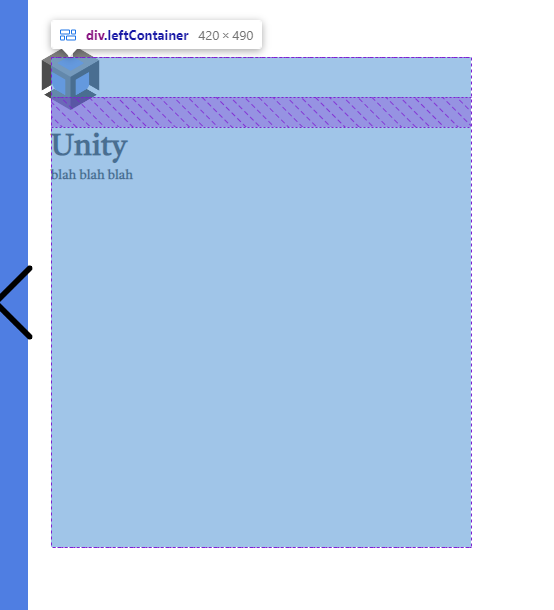
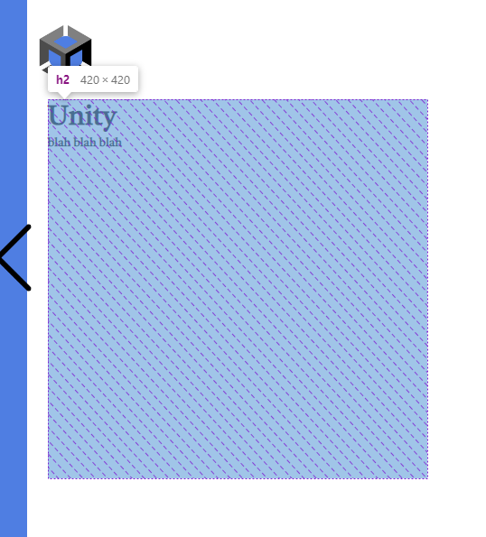
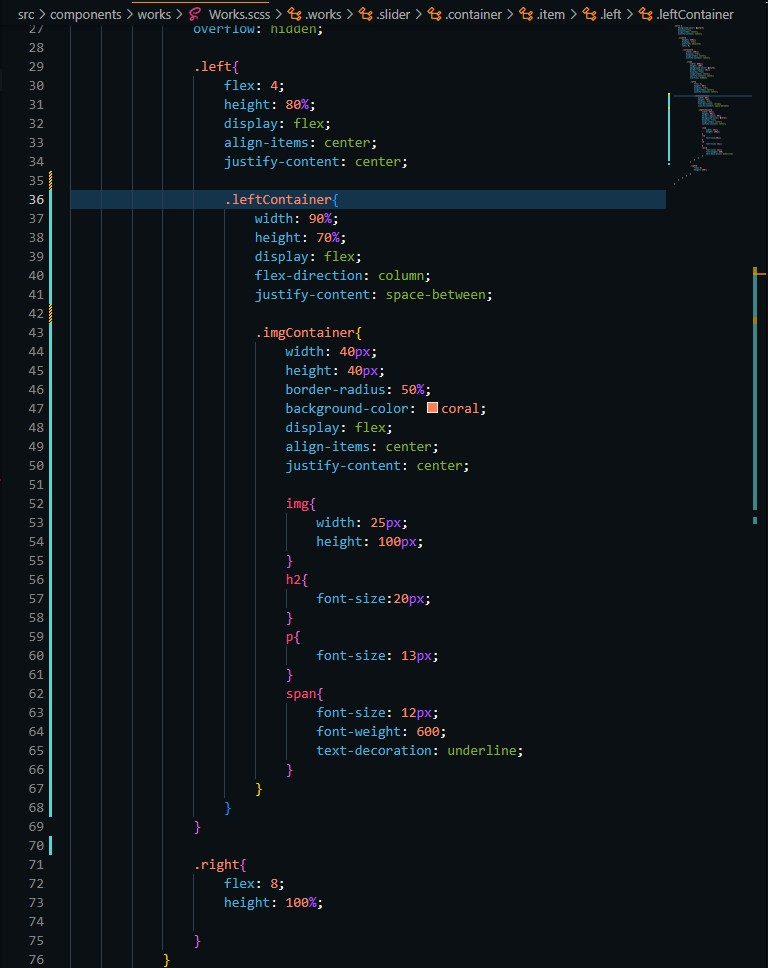
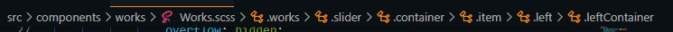
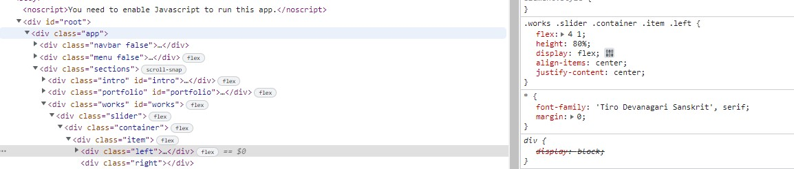

# SCSS Troubles

I was having a lot of trouble figuring out how to get my png spacing correct on my website because it was leaving a lot of white space on the bottom of the image.

```scss
> *{
    width: 100vw;
    height: calc(100vh - 70px);
    scroll-snap-align: start;
            
}
```

Here `vh` means the viewport height of the viewable screen height.

so I have to adjust my viewport here to account for the top nav bar that I have set earlier

```scss
     .sections {
        width: 100%;
        height: calc(100vh - 70px);
        background-color:lightcoral;
        position: relative;
        top: 70px;
```

Now trying to fix the white space at the bottom of my PNG and seeing if its a picture resolution size or scss sizing problem...

-------------------------------
The solution : 

My main issue I was having was my conatiner that I placed the image in was not the same size as the webpage so I was not getting my desired look on the page.

```scss
.intro{
    background: white;
    display: flex;

    .left{
        flex: 0.5;
        overflow: hidden;

        .imageContainer {
            width: 1200px;
            height: calc(100vh - 70px);
            background-color: rgb(79, 126, 226);
            border-radius: 60%;
            display: flex;
            align-items: flex-end;
            justify-content: center;
            float: right;
        
            img {
                height: 115%;    
                width: 115%;
                transform: scaleX(-1);
                border: hidden;
            }
            
        }
    }
```

The important thing here was that I calculated the height of my container to match the height of the section.

Next was just fiddling around with positioning in the `img`

Fun trick I used was `transform scaleX(-1)` in order to mirror the image since I was a bit leaned over in one direction in my original pic.

----

Ok so I just found out something super cool and it helped me fix a ton of formatting issues that I was having.

I was having trouble getting the height of a header and a `<p>` tag matching up so that the tag's contents were right under the header.



here we can see the size of the div we have to work with and I solved this by putting the `<p>` tag inside of the header tag and viola!



``` jsx
<h2>{d.title}
                <p>{d.description}</p>
                </h2>
```
It's honestly a pretty dumb and minor thing but hey maybe it helps someone out with a formatting issue!

----
## Overflow

the `overflow` property is really nice to use in a lot of ways ebcause it allows us to format things so that they fit in nice little neat spots that we create.

So I created a white container to house some items I was using on a scroll page, and turns out my rounded borders were being over-written due to the background color


I was noticing a problem with my colors overflowing in different div's and my `border-radius` property was getting overwritten.

Turns out it was a simple fix using `overflow: hidden`


----

## Using animations

I started implementing animations for certain images on my page to give it a more alive feel to my page such as animating this small arrow bouncing.

``` scss 

            img {
                width: 80px;
                animation: arrowBounce 2s infinite;
            }

            @keyframes arrowBounce {
                0%, 20%, 50%, 80%, 100% {
                  transform: translateY(0);
                }
                40% {
                  transform: translateY(-30px);
                }
                60% {
                  transform: translateY(-15px);
                }
              }

```

the percentage values are used to separate the frames of the arrow and how it's going to be animated.

This allows us to specifically time movements to get the smoothest outcome.

----

## React components

I am implementing some packages that I have found on the web to add some more flare to my website and make it look more crisp.

Ran across some issues with react hooks, and found out that all react components **MUST** start with capital letters. Good to know.

```jsx

export default function Intro() {

  const textRef = useRef();

  useEffect(() => {
    init(textRef.current, { 
      showCursor: false, 
      strings: ['Developer','Designer','Creator' ] 
    });
  }, []); 

  ```

  A silly mistake I made making my intro function lowercase, changing it made the package work.  Learning the hard way today.

----

## Quality of life choices

A lot of the time when I am using anchors `<a>` I don't want them to open on the same page that I am using especially if it is my portfolio

I want to keep the user's eyes on my page as much as possible so a cool trick I found was to use 

`target="_blank"`

But quickly found out that there are many security risks when just using this line.

we have to also include the `rel` attribute and use the keywords `"noopener noreferrer"` resulting in `rel="noopener noreferrer"`

`noopener` instructs our browser to navigate to the target resource without granting the new browsing any context access to the document that opened it.


----

## SCSS debugging tips

Something I have noticed a lot of while making my scss was that I would often get unresponsive results when styling my components.

Issues have ranged from not putting `div` tags in the correct spots to simple typos.

Something that has really helped me was inspect tool and also a tool in VScode that really lays things out for you in a hierarchal layout.  Let me show you.



Now look at the tob bar where my tabs would be 



You'll notice how all of them are lined up corresponding to how they are layered in my styling sheet, making it very easy for me to see if things are being added correctly and in the correct spots.

extra tid-bit



If you look in the browser inspect tool you can also see if the stylesheet is being inherited by the component to check if you mispelled it or if you have misplaced a component.

